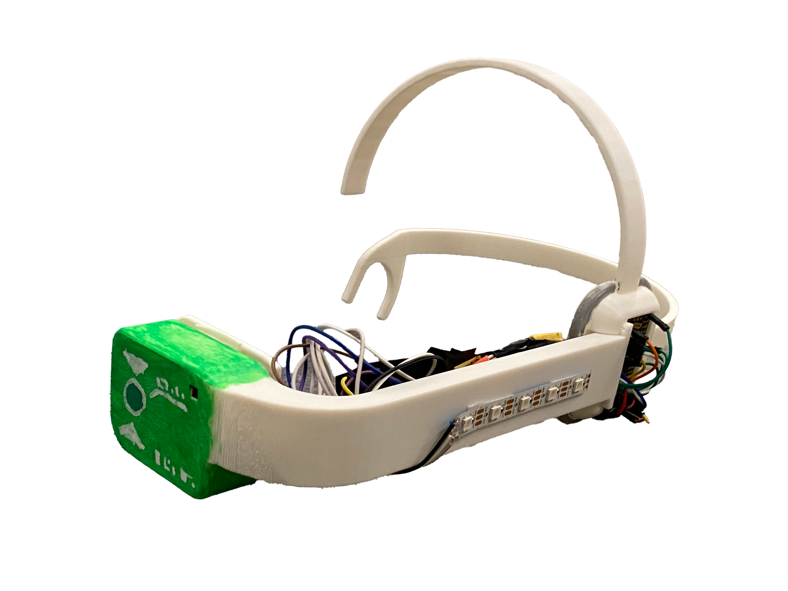
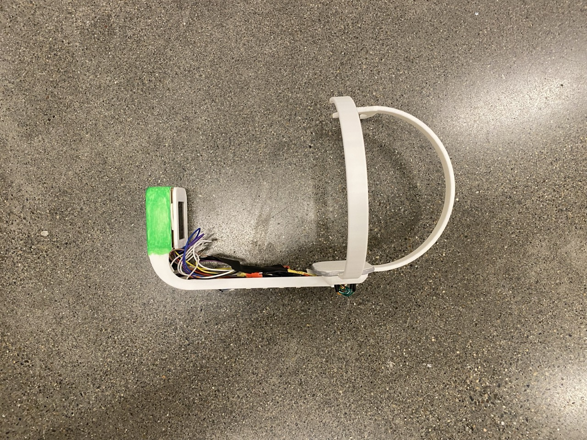
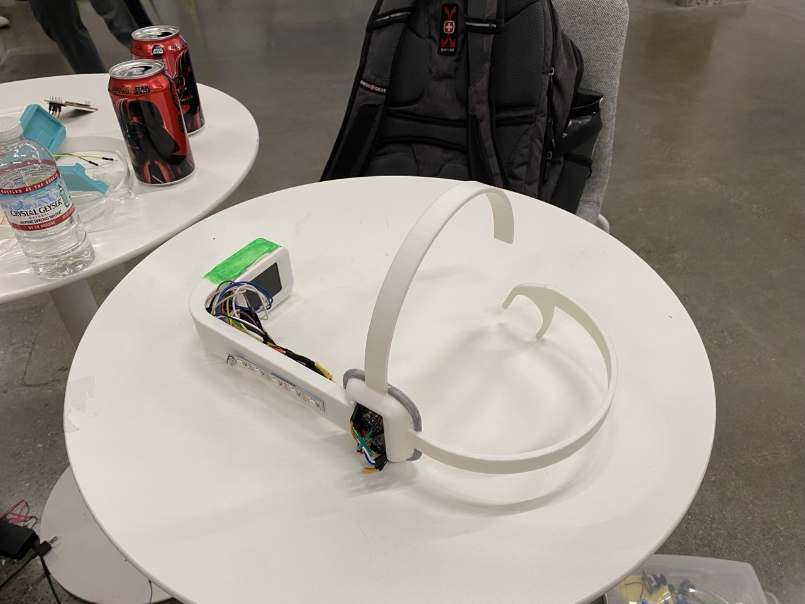

# Underscouter

*A Dragon Ball Z inspired headset and interactive experience*

by [@crkalapat](https://github.com/crkalapat), [@DinosaurPotato534](https://github.com/DinosaurPotato534), and [@Ectopl4sm](https://github.com/Ectopl4sm)

## Description

We took inspiration from the Dragon Ball Z anime's [Scouter](https://dragonball.fandom.com/wiki/Scouter) device and [Bop It](https://en.wikipedia.org/wiki/Bop_It) to make Underscouter for the [Undercity Hackathon](https://highway.hackclub.com/getting-started/undercity). Underscouter provides a game like experience by displaying various actions on the LCD screen for you to do as fast as possible.

The possible actions are:

- Dodge Right
- Dodge Left
- Jump Up
- Kick (press the *kick* button as specified in firmware)
- Punch (press the *punch* button as specified in firmware)

## Usage

To experience Underscouter, place the assembled headset on your face with the provided firmware using CircuitPython. Make sure that the headset microcontroller is plugged into your computer. Connect the two buttons to the other microcontroller, and connect that microcontroller to the same computer as before.

